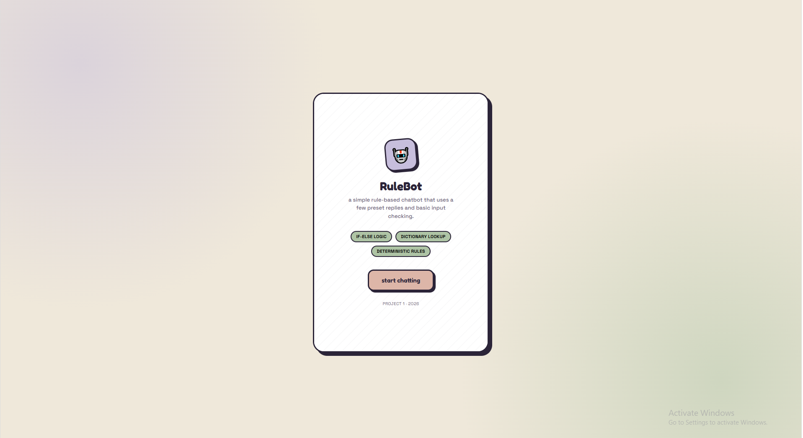
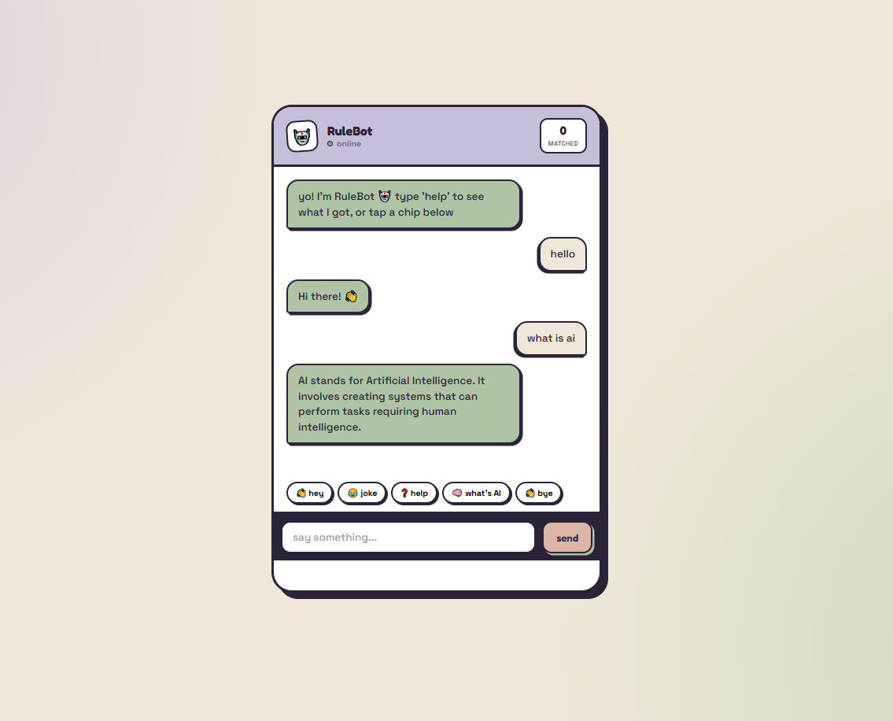

# 🤖 RuleBot — DecodeLabs Project 1

> My first GitHub project and my first project at **DecodeLabs**.

RuleBot is a simple **rule-based chatbot** made using HTML, CSS, and JavaScript.

This is **Project 1** of my DecodeLabs learning journey. I built this project to understand the basics of creating an interactive web application, handling user input, using JavaScript logic, and working with the DOM.

The chatbot does not use an external AI API. Instead, it matches the user's message with predefined responses and replies accordingly.

---

## 🎯 About This Project

This project helped me practice:

- HTML page structure
- CSS styling and UI design
- JavaScript fundamentals
- Functions and objects
- User input handling
- DOM manipulation
- Event listeners
- Basic chatbot logic
- Input sanitization
- Git and GitHub basics

As this is my **first GitHub project**, it is also an opportunity for me to learn how to organize a project, write documentation, and share my work publicly.

---

## ✨ Features

- 🤖 Rule-based chatbot
- 💬 Interactive chat interface
- 👋 Greeting responses
- 🧠 Basic AI-related questions
- 💻 Programming-related questions
- 🏏 Cricket-related responses
- 😂 Joke response
- ❓ Help command
- 👋 Exit commands
- ⌨️ Input sanitization
- 🔎 Predefined response matching
- ⏳ Typing animation
- 📊 Matched-response counter
- 📱 Mobile-style interface
- 🚫 No external AI API

---

## 🎬 Demo

### Example conversation

```text
User: hello

RuleBot: Hi there! 👋
```

```text
User: what is javascript?

RuleBot: JavaScript is a programming language commonly used
to make web pages interactive.
```

If RuleBot doesn't recognize a message:

```text
User: tell me something random

RuleBot: I don't understand that yet.
Type 'help' to see the commands I know.
```

---

## 📸 Screenshots

### Landing Screen



### Chat Screen




---

## 🛠️ Built With

- **HTML5** — structure
- **CSS3** — styling and layout
- **JavaScript** — chatbot logic
- **Google Fonts** — typography

No frameworks or backend are required.

---

## 🧠 How It Works

RuleBot uses a JavaScript object to store its predefined responses.

```javascript
const responses = {
    "hello": "Hi there! 👋",
    "hi": "Hello! I'm RuleBot 🤖",
    "joke": "Why do programmers prefer dark mode? Because light attracts bugs! 😄"
};
```

When a user enters a message:

1. The message is cleaned and converted to lowercase.
2. RuleBot checks the predefined responses.
3. If a match is found, the corresponding reply is displayed.
4. If there is no match, a fallback message is shown.
5. The matched counter is updated when a known command is used.

---

## 💻 How to Run

No installation is required.

1. Download or clone this repository.
2. Open `index.html`.
3. Open it in a web browser.
4. Click **Start Chatting**.
5. Start talking to RuleBot.

---

## 📁 Project Structure

```text
RuleBot/
│
├── index.html
├── README.md
│
└── screenshots/
    ├── landing.png
    └── chat.png
```

---

## 🚀 Future Improvements

This is only my first project, so there are many things I can improve in future versions:

- [ ] Add more responses
- [ ] Improve keyword matching
- [ ] Support different ways of asking questions
- [ ] Add dark mode
- [ ] Add voice input
- [ ] Save chat history
- [ ] Add a backend
- [ ] Connect an AI API
- [ ] Add more chatbot features

---

## 📚 What I Learned

While building this project, I got practical experience with:

- JavaScript objects and functions
- DOM manipulation
- Event listeners
- User input
- CSS layouts
- Building an interactive UI
- Organizing a project for GitHub
- Writing a README file

---

## 🏆 DecodeLabs

**Project 1 — Rule-Based Chatbot**

This project was completed as part of my learning journey at **DecodeLabs**.

It is my **first project on GitHub**, and I plan to keep improving my development skills and building more projects.

---

## 👨‍💻 Author

**Rohan Kumar**

🎓 Student & Developer  
🚀 First GitHub Project  
📚 DecodeLabs — Project 1

---

⭐ Thanks for checking out my first project!
